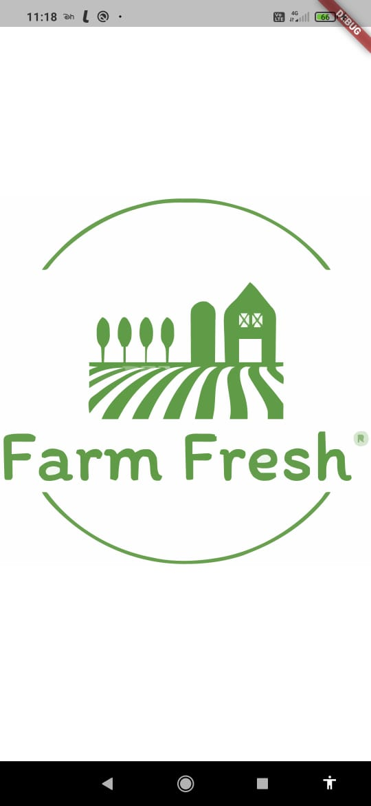
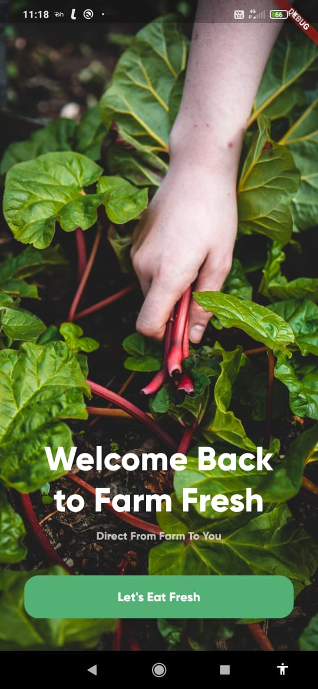
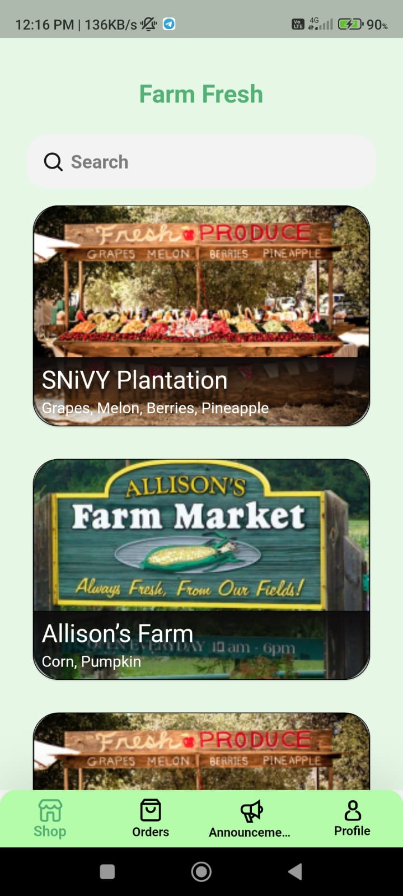
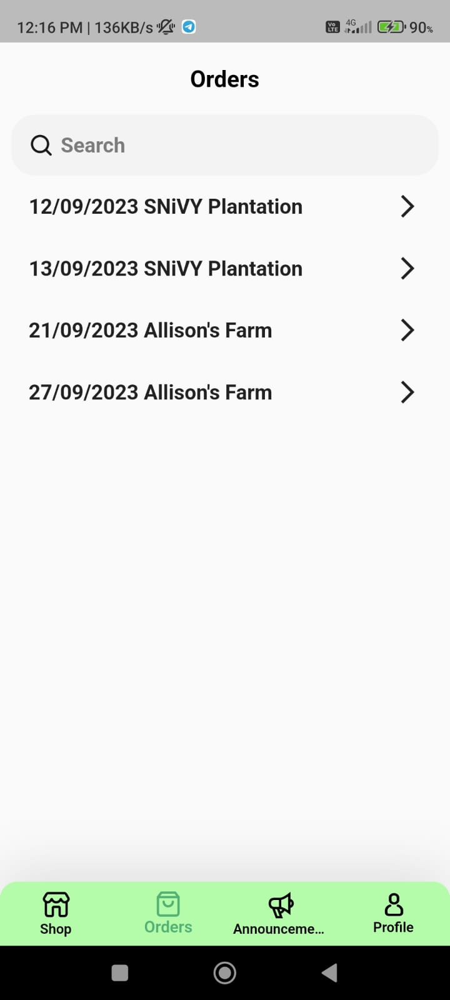
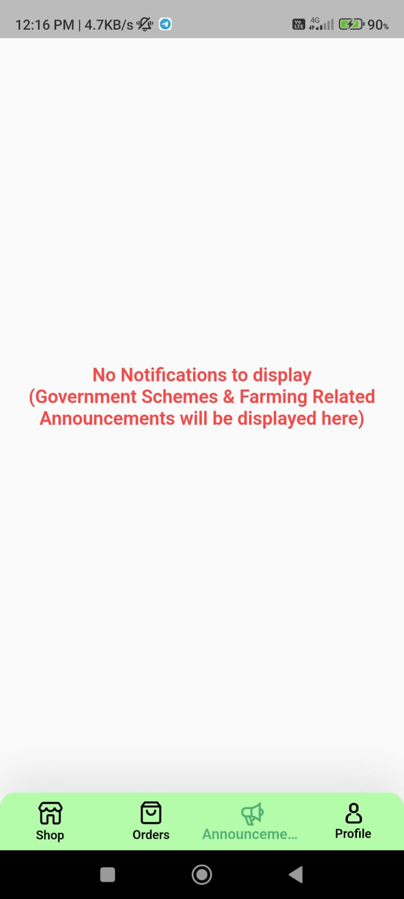
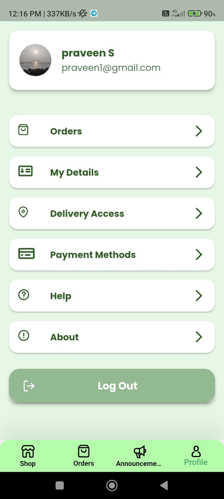
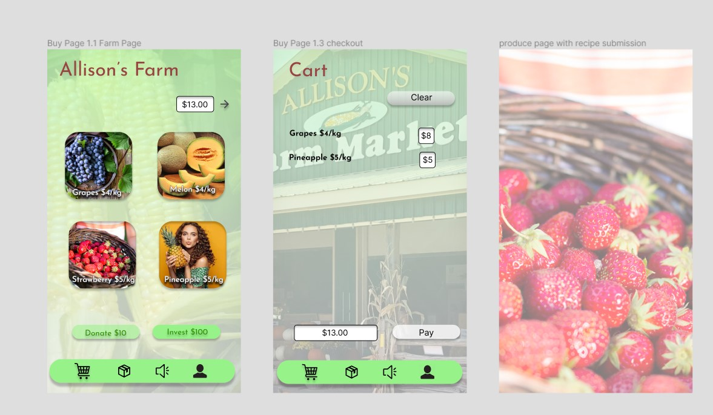
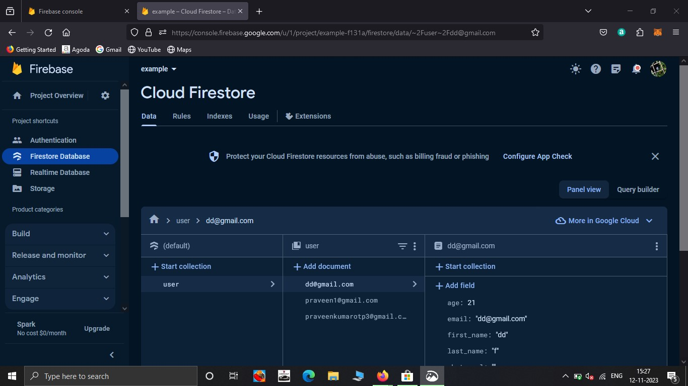

Appchemists
Direct from Farm App - GTASP2005/06
-------------  
### To try the app download the apk from the [Drive Link](https://drive.google.com/drive/folders/1s3VZ2YfswkFdDaQBEoK6AuzrnoocMC0P?usp=sharing)  
-------------
  
##### Stack : Flutter Firebase
##### Figma : [Online Groceries App UI](https://www.figma.com/file/cTwn56bgm3dIxUwuW1GEOQ/GTA-Sandshores?type=design&node-id=1%3A2&mode=design&t=sGDIxHC97OSz3FR9-1)  
  
-------------  

## Problem Statement: 6. Direct from Farm App - GTASP2005/06

Platform for farmers to directly sell their produce - fruits /vegetables/grocery to consumers. 
We need a mobile app by which farmers can directly take orders from consumers and can directly sell their products to consumers without any mediator.
Primary User : Farmer 
Secondary User : Buyer

Summary:

Our innovative solution for the hackathon centers around empowering farmers and consumers through a user-friendly mobile app, seamlessly connecting them in a direct marketplace. Leveraging Flutter and Firebase, the app enables farmers to establish and manage their online stores, offering a diverse range of produce.

To address the challenges faced by Indian farmers, we've incorporated unique features. Consumers can directly contribute to farmers through a donation option and invest in a farm store before a season, gaining a credit that lasts a lifetime. This forward-thinking approach aims to alleviate financial burdens on farmers while fostering a sense of community support.

The app goes beyond mere transactions. Farmers can showcase their products, detailing farming practices, processes, and even sharing insights into the origin of the food. Each product page is a treasure trove, providing pricing details, recipe suggestions, and a platform for users to contribute and share their own recipes.

An Announcements tab directly explains and introduces Farmers to newly published government policies and schemes.

Our streamlined payment process eliminates intermediaries, with consumers making direct payments to farmers through UPI or QR codes. This not only ensures farmers receive the full amount but also simplifies the user experience, offering instant order confirmation and the option for consumers to pick up their purchases directly.

Furthermore, the app introduces a premium produce booking feature, enhancing the overall user experience. By focusing on transparency, engagement, and direct financial support to farmers, our solution aims to revolutionize the way consumers and farmers interact, fostering a sustainable and mutually beneficial agricultural ecosystem.

  
   
  
  
   
  
  
  Revised Mockups
  
  
  
  Firebase Console
  
   

-------------  

## Credits  
- [Sanjon Rion](www.linkedin.com/in/sanjon-rion-snivy27272713) 
- [Praveen Kumar](https://www.linkedin.com/in/praveen-kumar-852097214?lipi=urn%3Ali%3Apage%3Ad_flagship3_profile_view_base%3BcSqvjqn3SGyyRMQ4dD1BMA%3D%3D)
